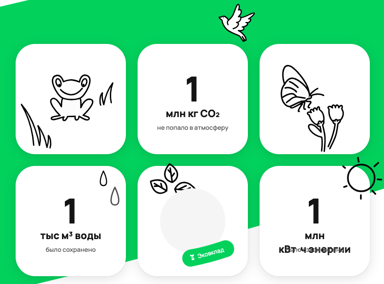
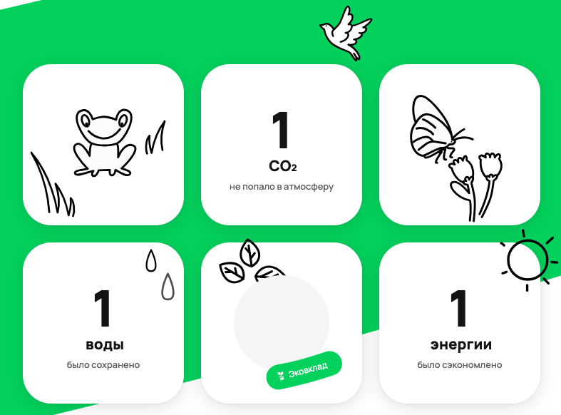
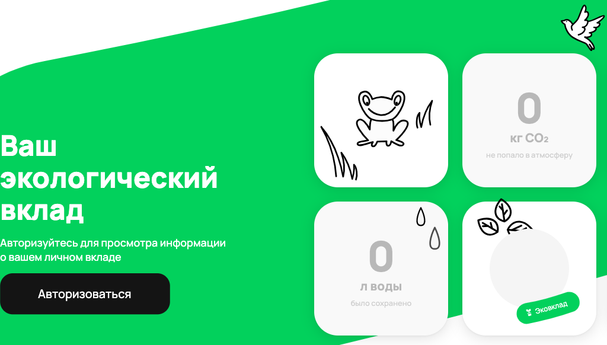

# Баг-репорты скриншотных тестов

## bug_1. [Конвертация единиц измерения счётчиков эковклада] В счётчиках СО2 и энергии некорректно преобразовываются единицы измерения при значении 1000000

### Приоритет: low

### Предусловие:
Авторизоваться под пользователем с эковкладом СО2 = 1000000 и энергии = 1000000  
// тут должны быть логин и пароль тестового пользователя

### Шаги воспроизведения:
1. Перейти на страницу www.avito.ru/avito-care/eco-impact  

### Ожидаемый результат:
Счётчик СО2 отображается как 1 `тыс тонн`  
Счётчик энергии отображается как 1 `тыс МВт/ч`  
Элементы счётчика не накладываются друг на друга

### Фактический результат:  
Счётчик СО2 отображается как 1 `млн кг`  
Счётчик энергии отображается как 1 `млн кВт/ч`  
Элемент счётчика энергии, содержащий текст `кВт/ч энергии` накладываются элемент с текстом `было сэкономлено`

---

## bug_2. [Конвертация единиц измерения эковклада] Пропадают единицы измерения счётчиков при их значении 1000000000000000

### Приоритет: low

### Предусловие:
Авторизоваться под пользователем с эковкладом воды = 1000000000000000, СО2 = 1000000000000000 и энергии = 1000000000000000  
// тут должны быть логин и пароль тестового пользователя

### Шаги воспроизведения:
1. Перейти на страницу www.avito.ru/avito-care/eco-impact  

### Ожидаемый результат:  
Счётчик воды отображается как 1 `квад м^3`  
Счётчик СО2 отображается как 1 `квад тонн`  
Счётчик энергии отображается как 1 `квад МВт/ч`

### Фактический результат:  
Счётчик воды отображается как `1` без единиц измерения  
Счётчик СО2 отображается как `1` без единиц измерения  
Счётчик энергии отображается как `1` без единиц измерения  

---

## bug_3. [Округление значений счётчика эковклада] Некорректное округление значения счётчика в большую сторону

### Приоритет: low

### Описание:
При преобразовании значений счётчиков некорректно округляются в большую сторону цифры `1, 4, 6, 9`, если после них стоит `5`

### Предусловие:
Авторизоваться под пользователем с эковкладом  
1. воды = 1150, СО2 = 1450 и энергии = 1650
2. воды = 9950, СО2 = 9990 и энергии = 9949  
// тут должны быть логин и пароль тестовых пользователей

### Шаги воспроизведения:
1. Перейти на страницу www.avito.ru/avito-care/eco-impact  

### Ожидаемый результат:  
1. Первый пользователь
   - Значение в счётчике воды отображается как `1,2` м^3  
   - Значение в счётчике СО2 отображается как `1,5` тонн  
   - Значение в счётчике энергии отображается как `1,7` МВт/ч  
2. Второй пользователь
   - Значение в счётчике воды отображается как 1 `10` м^3
   - Значение в счётчике СО2 отображается как `10` тонн
   - Значение в счётчике энергии отображается как `10` МВт/ч  

### Фактический результат:
1. Первый пользователь
   - Счётчик воды отображается как `1,2` м^3
   - Счётчик СО2 отображается как `1,5` тонн
   - Счётчик энергии отображается как `1,7` МВт/ч    
2. Второй пользователь
   - Счётчик воды отображается как `1,2` м^3
   - Счётчик СО2 отображается как `1,5` тонн
   - Счётчик энергии отображается как `1,7` МВт/ч  

---

## bug_4. [Невалидные значения счётчиков эковклада] Невалидные значения не отображаются как 0

### Приоритет: low

### Описание:
Если с бэка приходят невалидные данные в значениях счётчиков, фронт обрабатывает их как:  
- строку, массив, объект как NaN
- массив с одним числовым значением, true, отрицательное число как валидное значение

### Предусловие:
Авторизоваться под пользователем с эковкладом  
1. воды = -99, СО2 = None и энергии = "string"
2. воды = [-3], СО2 = True и энергии = False  
3. воды = "", СО2 = [5, 2] и энергии = {}  
// тут должны быть логин и пароль тестовых пользователей

### Шаги воспроизведения:
1. Перейти на страницу www.avito.ru/avito-care/eco-impact  

### Ожидаемый результат:  
Во всех случаях значения счётчиков отображаются как 0, цвет шрифта - серый.

### Фактический результат:
1. Первый пользователь
   - Счётчик воды отображается как `-99` л
   - Счётчик энергии отображается как `NaN` кВт/ч    
2. Второй пользователь
   - Счётчик воды отображается как `-3` л
   - Счётчик СО2 отображается как `1` кг
3. Третий пользователь
   - Счётчик СО2 отображается как `NaN` кг
   - Счётчик энергии отображается как `NaN` кВт/ч  

---

## bug_5. [Адаптив десктопной страницы эковклада] Не отображается счётчик при меньшем разрешении экрана

### Приоритет: low

### Шаги воспроизведения:
1. Перейти на страницу www.avito.ru/avito-care/eco-impact  
2. Изменить разрешение экрана на 1024х768

### Ожидаемый результат:
На странице отображаются все три счётчика

### Фактический результат:  
Не отображается счётчик сэкономленной энергии

