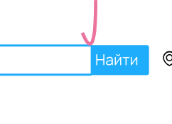
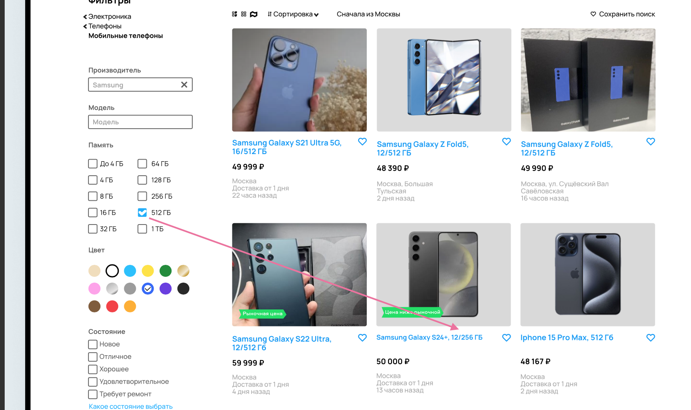
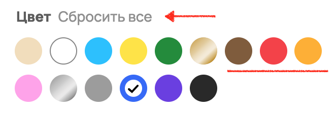

## Баги на старнице со скриншота

**1. [Лого]** Ошибка в названии компании: Awito вместо Avito    
Приоритет: high - имиджевый баг  

**2. [Кнопка “Все категории”]** Кнопка слиплась с полем ввода поиска  
Приоритет: low  

**3. [Кнопка “Все категории”]** Кнопка имеет меньшую высоту относительно поля ввода поиска  
Приоритет: low  

**4. [Кнопка “Найти”]** Кнопка имеет меньшую высоту относительно поля ввода поиска  
Приоритет: low  

**5. [Кнопка “Найти”]** Левый отступ текста “Найти” не соответствует правому отступу  
Приоритет: low  

**6. [Хлебные крошки]** Текст категорий не унифицирован (Названия категорий начинаются то с заглавной, то со строчной буквы)  
Приоритет: low  

**7. [Хлебные крошки]** Отсутствует конечная хлебная крошка “Samsung”  
Приоритет: low  

**8. [Иконки]** Неунифицированный вид иконок (где то слишком жирные, где то тоньше)  
  1. Иконка кнопки "Все категории"  
  2. Иконки фильтра рубрикатора (электроника/телефоны)  
  3. Иконки типа отображения объявлений (вывода списком с фото, вывода отображения на карте)  
  4. Иконка дропдаун меню сортировки  
  5. Иконка очистки в поле ввода данных  
  6. Иконки в чекбоксах  

Приоритет: low  

**9. [Иконка способа отображения объявлений]** Визуально не выделена активная иконка способа отображения (в данном случае, иконка галереи)  
Приоритет: low  

**10. [Фильтр “Сначала из Москвы”]** Отсутствует тогл, который вкл/выкл функцию фильтрации  
Приоритет: medium - отсутствует возможность применения функционала  

**11. [Поле ввода производителя]** Текст названия производителя выглядит как плейсхолдер (если выбран производитель, то текст его названия должен быть визуально темнее текста плейсхолдера)  
Приоритет: low  

**12. [Заголовки блоков фильтров]** Нижние отступы заголовков фильтров “Память” и “Цвет” больше, чем остальные  
Приоритет: low  

**13. [Фильтр состояния товара]** Грамматическая ошибка в чекбоксе “Требуется ремонт”  
Приоритет: low  

**14. [Фильтр по цене]** Длина поля ввода цены “от” меньше длины поля “до”  
Приоритет: low  

**15. [Фильтр по цене]** В поле ввода верхней цены отсутствует текст “до”  
Приоритет: low  

**16. [Фильтр по типу продавца]** Неунифицированные отступы текста внутри радиокнопок (у кнопки “Частные” отступ справа больше, отступы кнопки “Все” меньше, чем у двух других)  
Приоритет: low  

**17. [Кнопка “Показать N объявлений”]** Верхний и нижний отступы текста кнопки непропорциональны боковым отступам  
Приоритет: low  

**18. [Поиск по фильтру “Производитель”]** Некорректно отрабатывает поиск по производителю. Присутствуют объявления, которые не удовлетворяют заданному фильтру (при выбранном фильтре  со значением “Samsung” присутствуют объявления о продаже Apple iPhone)  
Приоритет: high  

**19. [Поиск по фильтру “Память”]** Некорректно отрабатывает поиск по объему памяти. Присутствуют объявления, которые не удовлетворяют заданному фильтру (при выбранном фильтре  со значением “512 гб” присутствуют объявления о продаже телефона с памятью 256 гб)  
Приоритет: high  

**20. [Поиск по фильтру “Цвет”]** Некорректно отрабатывает поиск по цвету телефона. Присутствуют объявления, которые не удовлетворяют заданному фильтру (при выбранном фильтре  со значением “синий” присутствуют объявления о продаже серых телефонов)  
Приоритет: high  

**21. [Поиск по фильтру “Цена”]** Некорректно отрабатывает поиск по диапазону цен. Присутствуют объявления, которые не удовлетворяют заданному фильтру (при выбранном фильтре  со значением “до 50000” присутствуют объявления с ценой более 50000)  
Приоритет: high  

**22. [Заголовки объявления]** Заголовки объявлений имеют разные верхние отступы. Текст в заголовках имеет разный размер шрифта. Это влияет на остальные элементы (цена, локация, время публикации), которые также смещаются вниз/вверх относительно других объявлений  
Приоритет: medium - т.к. баг встречается часто и сильно отражается на визуале  

**23. [Локация объявления]** Элемент времени пути до точки слипся с названием станции метро  
Приоритет: low  

*??? Считается ли багом то, что в локации объявления отображается город Москва, если в правом верхнем углу уже выбрана геопозиция Москвы. Локация в объявлении отображается будто поиск происходит из другого города.*

**24. [Результаты поиска]** Не совпадает найденное количество объявлений в кнопке “Показать N объявлений” и в заголовке страницы  
Приоритет: low  
>Такое может случиться, если провести поиск по одним параметрам, а потом добавить дополнительные параметры. При выборе дополнительных параметров на кнопке “Показать N объявлений” сразу отображается количество найденных объявлений, но количество в заголовке и отображаемые объявления не обновятся пока мы не нажмем на эту кнопку. Судя по отображаемым объявлениям кнопка “Показать N объявлений” была нажата, следовательно это, скорее всего, баг.  

**25. [Пагинация]** Отсутствует элемент с пагинацией под блоком с объявлениями.  
Найдено 77 объявлений, из которых отображаются только 12. Невозможно перейти на следующую страницу для просмотра остальных объявлений  
Приоритет: high

**26. [Изображение в объявлении]** Изображение в объявлении не совпадает с товаром, указанном в заголовке объявления.  
Приоритет: low  
>Это может быть, банально, ошибкой при модерации объявления, но допускаю возможность некорректного отображения заголовка или изображения объявления.  

_______________________________________________

### Найденные баги, если скриншот нужно было сравнивать с продом:

__27.__ В заголовке страницы отсутствует упоминание искомого производителя  
Приоритет: low  
ФР:  
  
ОР:  

__28.__ Отсутствуют параметры характеристик в карточке объявления (состояние, диагональ)  
Приоритет: low  
ФР:  
  
ОР:  

__29.__ В элементе с локацией объявления отсутствует иконка рядом с названием станции, отображающая соответствующий цвет линии метро  
Приоритет: low  
ФР:  
  
ОР:  

__30.__ Отсутствует иконка элемента, указывающего время пути до точки, указанного в объявлении  
Приоритет: low  
ФР:  
  
ОР:  

__31.__ Отсутствует блок с фильтром по оперативной памяти устройства  
Приоритет: low  
ФР:  
  
ОР:  

__32.__ В блоке с фильтром по цвету отсутствует кнопка "Сбросить все" и цвета расположены в другом порядке  
Приоритет: low  
ФР:  
  
ОР:  

_Между блоками фильтров состояния и цены присутствует блок с акциями. Решила отметить, но, скорее всего, это не баг, т.к. скрин мог быть сделан до того как убрали фичу._  
 

__33.__ В блоке с фильтром по цене введенное число имеет разделитель по тысячным и жирный шрифт  
Приоритет: low  
ФР:  
  
ОР:  

__34.__ У фильтра “С Авито Доставкой” отсутствует тултип  
Приоритет: low  
ФР:  
  
ОР:  

__35.__ Отсутствует фильтр “Бесплатная доставка”  
Приоритет: low  
ФР:  
  
ОР:  

__36.__ Бордеры полей ввода, чекбоксов, радиокнопок слишком толстые  
Приоритет: low  
ФР:  
  
ОР:  

__37.__ Отсутствует часть футера страницы (блоки с рубрикатором и дополнительной информацией)  
Приоритет: low  
ФР:  
  
ОР:  

__38.__  Навигатор футера страницы не прижат к нижней границе экрана  
Приоритет: low  
ФР:  
  
ОР:  

__39.__ Под элементом пагинации отсутствует блок с объявлениями “Популярное”  
Приоритет: low  
ФР:  
  
ОР:  

__40.__ Отличаются баджи карточек объявлений (закругленные углы и другой шрифт текста)  
Приоритет: low  
ФР:  
  
ОР:  

